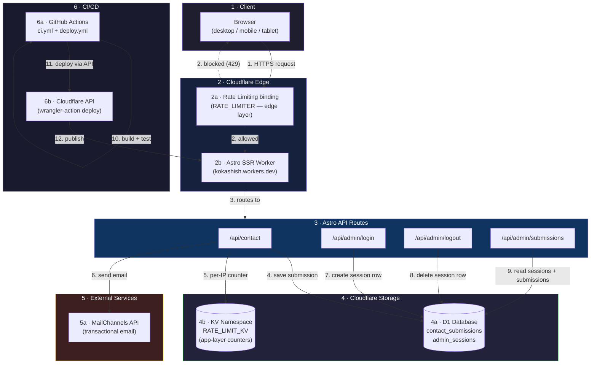

# Architecture

High-level component view of the whole system: client, edge/Worker runtime,
storage, external services, and the deploy pipeline that ships it all.

## Component notes

1. **Client** — plain Astro-rendered pages, no client-side framework runtime; a few `<script>` islands for form handling, dark-mode toggle, and admin UI interactivity.
2. **Edge — Rate Limiting binding** — Cloudflare's native `RATE_LIMITER` binding evaluates *before* Worker code runs. First line of defense against abusive IPs. See [sequence-contact-form.md](./sequence-contact-form.md).
3. **Astro SSR Worker** — all rendering and API routes execute in a single Cloudflare Worker (`@astrojs/cloudflare` adapter), deployed as `dist/_worker.js`.
4. **D1** — single SQLite-compatible database with two tables: `contact_submissions` (public form data) and `admin_sessions` (server-side session store, added to make logout an actual revocation instead of a client-side cookie clear).
5. **KV — RATE_LIMIT_KV** — app-layer rate-limit counters, keyed per IP per route. Persists across Worker cold starts, unlike an in-memory `Map`.
6. **MailChannels** — outbound-only integration; contact form emails are sent here *after* the D1 write succeeds, so a submission is never lost even if email delivery fails.
7. **GitHub Actions** — `ci.yml` runs on every PR + daily cron; `deploy.yml` runs on push to `main`, gated behind the same CI checks (`needs: ci`).
8. **Cloudflare API** — the deploy job authenticates with `CLOUDFLARE_API_TOKEN`/`CLOUDFLARE_ACCOUNT_ID` (GitHub Secrets) and publishes via `cloudflare/wrangler-action`. See [deployment-pipeline.md](./deployment-pipeline.md).
