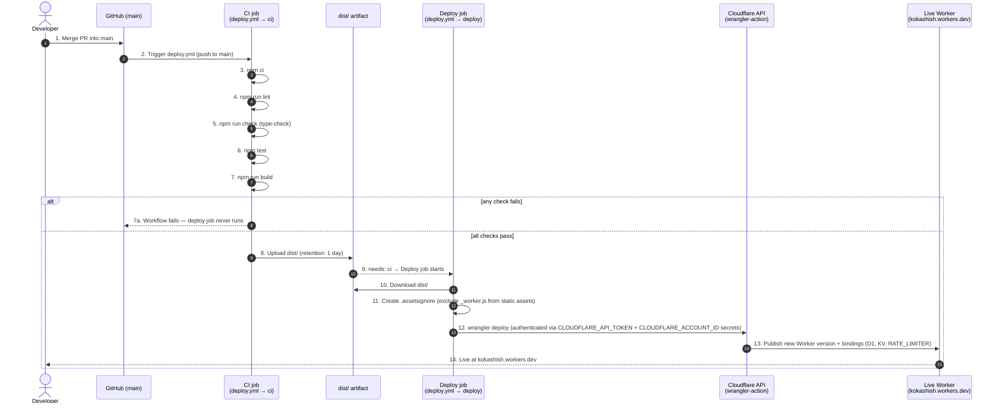

# Deployment Pipeline

Numbered flow from a merged commit on `main` to a live Cloudflare deployment.

## Notes

- **Step 2** — the workflow triggers only on push to `main`; there is no manual `wrangler deploy` from a laptop as the primary path.
- **Steps 3–7** — the same checks required for any PR (`ci.yml`) run again here, so `main` can never deploy a build that hasn't passed lint/type-check/tests.
- **Step 9 (`needs: ci`)** — the deploy job is hard-gated on the CI job succeeding; a failing check stops the deploy entirely.
- **Step 12** — secrets (`CLOUDFLARE_API_TOKEN`, `CLOUDFLARE_ACCOUNT_ID`) live in GitHub Actions secrets, never in the repo. `ADMIN_PASSWORD` / `TO_EMAIL` are separate Worker secrets set via `npx wrangler secret put`, also never committed.
- **Step 13** — bindings declared in `wrangler.toml` (D1, KV, rate limiter) are published together with the Worker code — no separate manual binding step.
