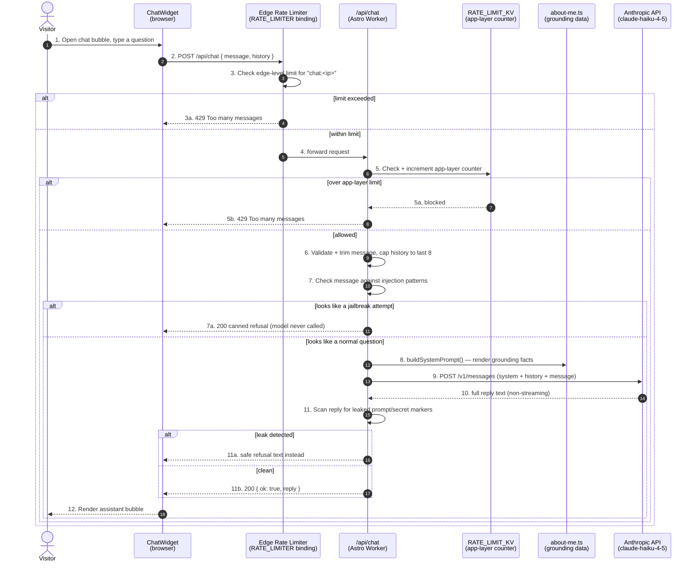

# Sequence — Portfolio Chatbot

Numbered flow for a single chat message, including the input-side injection
filter, both rate-limit layers, and the output-side leak filter.

## Why the order matters

- **Steps 3 → 5 before 6** — both rate-limit layers run before any input
  validation or model call, so an attacker can't run up API costs even by
  sending malformed requests.
- **Step 7 before 9** — the injection pre-filter runs *before* the Anthropic
  call, not after. A caught attempt costs nothing and never reaches the
  model.
- **Step 11 before 11b** — the full reply is inspected before it's ever
  sent to the browser, which is only possible because the response is
  buffered rather than streamed token-by-token. See the "Non-streaming, on
  purpose" note in [DECISIONS.md](../../DECISIONS.md).
