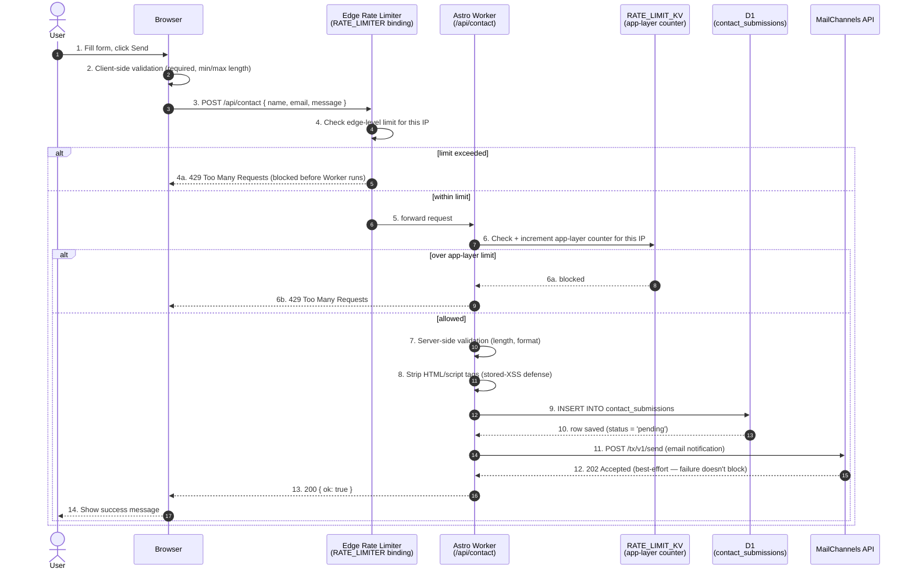

# Sequence — Contact Form Submission

Numbered, end-to-end flow of a single contact form submission, including
both rate-limit layers and the D1-before-email ordering that guarantees a
submission is never lost even if MailChannels fails.

## Why this order matters

- **Step 6 before 9** — both rate-limit layers run before any DB write, so an attacker can't exhaust D1 capacity or storage even if the edge layer somehow misses them.
- **Step 9 before 11** — the submission is persisted to D1 *before* the email is attempted. If MailChannels is down or misconfigured, the message is still safely stored and visible in the admin UI — nothing is silently dropped.
- **Step 8 before 9** — sanitization happens before the value is ever written to D1 or handed to the email API, so the sanitized value — not the raw input — is what gets stored and sent.
